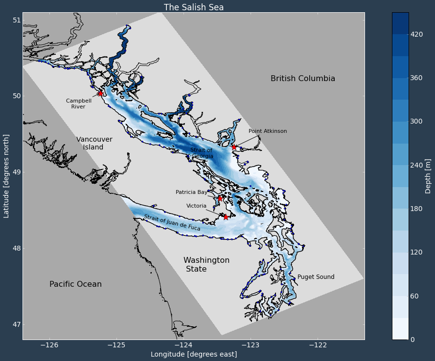

.. salishsea.eos.ubc.ca/nemo section landing page

:license:
  Copyright 2014-2016 The Salish Sea MEOPAR Contributors
  and The University of British Columbia

  Licensed under the Apache License, Version 2.0 (the "License");
  you may not use this file except in compliance with the License.
  You may obtain a copy of the License at

     http://www.apache.org/licenses/LICENSE-2.0

  Unless required by applicable law or agreed to in writing, software
  distributed under the License is distributed on an "AS IS" BASIS,
  WITHOUT WARRANTIES OR CONDITIONS OF ANY KIND, either express or implied.
  See the License for the specific language governing permissions and
  limitations under the License.

*********************
Salish Sea NEMO Model
*********************

About the Project
=================

The Salish Sea is home to a large population of Canadians living in coastal communities at risk to ocean related hazards.
There is an ongoing need to assess the impact of these hazards on human and marine environments through a multidisciplinary approach involving Canadian oceanographers,
biologists,
and social scientists.
The Marine Environmental Observation Prediction and Response network
(MEOPAR_)
provides a platform to accelerate this type of research.

.. _MEOPAR: http://meopar.ca/

The Salish Sea MEOPAR project team is developing a three-dimensional ocean model for the Strait of Georgia and Salish Sea.
Using the NEMO_ modelling architecture the Salish Sea model will be used to evaluate storm surge risk in coastal communities.
Long term goals include data assimilation from the VENUS network and a coupled biogeochemical modelling component.

Results
-------

Our results are available in a number of formats:

* Our Storm Surge forecast: https://salishsea.eos.ubc.ca/storm-surge/forecast.html
* A more general storm surge portal: https://salishsea.eos.ubc.ca/storm-surge/

* You can subscribe to our storm surge atom feed for Vancouver: https://salishsea.eos.ubc.ca/storm-surge/atom/pmv.xml

* Static plots of our results are: https://salishsea.eos.ubc.ca/nemo/results/

* Animations on ocean viewer: http://oceanviewer.org

* Full access to our nowcast results in numerous formats via an ERDDAP server: https://salishsea.eos.ubc.ca/erddap/

.. _NEMO: http://www.nemo-ocean.eu/

Domain
------

Evaluation
----------

**General evaluation:** as a `slide presentation`_.

.. _slide presentation: ../_static/nemo/model_evaluation_summary.pdf

**Storm surge:** The Salish Sea model's ability to calculate tides and sea surface height was evaluated by hindcasting storm surge events that occurred between 2002 and 2011.
(Soontiens, N., Allen, S., Latornell, D., Le Souef, K., Machuca, I., Paquin, J.-P., Lu, Y., Thompson, K., Korabel, V., 2016. Storm surges in the Strait of Georgia simulated with a regional model. *Atmosphere-Ocean* **54** 1-21. `https://dx.doi.org/10.1080/07055900.2015.1108899`_)

.. _https://dx.doi.org/10.1080/07055900.2015.1108899: https://dx.doi.org/10.1080/07055900.2015.1108899

**Mixing in San Juan/Gulf Islands:** The sensitivity of the deep water renewal into the Strait of Georgia and of fresh water pulses into Juan de Fuca Strait to modelling choices affecting both turbulence and advection has been determined.
(Soontiens, N. and Allen, S. Modelling sensitivities to mixing and advection in a sill-basin estuarine system. *Submitted to Ocean Modelling*)

Project Resources
=================

* The main project documentation site is at https://salishsea-meopar-docs.readthedocs.io/en/latest/.
* The project team maintains a set of Mercurial_ version control repositories for code,
  documentation (including the source files for this site),
  and analyses of model results.
  The contents of those repositories and their development history is accessible at https://bitbucket.org/salishsea/.

.. _Mercurial: https://www.mercurial-scm.org/

Project Team and Collaborators
==============================

The Salish Sea NEMO Model project is lead by `Susan Allen`_ in the Department of Earth, Ocean, and Atmospheric Sciences at the University of British Columbia.
Other team members:

* `Nancy Soontiens`_
* `Elise Olson`_
* Doug Latornell
* `Ben Moore-Maley`_
* Tereza Jarníková
* `Jie Liu`_
* Kate Le Souëf (emeritus)
* Idalia Machuca (emeritus)
* Muriel Dunn (emeritus)
* James Petrie (emeritus)

Researchers from several other teams in UBC EOAS joined the project team for the August 2015 Development Sprint on Stakeholder Support Features:

* Alex Huang
* Alyssia Law
* Karina Ramos Musalem
* Yingkai (Kyle) Sha
* Xiaoxin (Cindy) Yu

The team collaborates with other MEOPAR_ funded research teams at UBC:

* The observations team in EOAS lead by `Rich Pawlowicz`_:

  * Mark Halverson
  * Romain Di Costanzo
  * Chuning Wang (emeritus)

* The impacts and indictors of marine hazards team in the UBC School of Community and Regional Planning lead by `Stephanie Chang`_:

  * Jackie Yip
  * Christopher Carter
  * Rebecca Chaster
  * Ashley Lowcock
  * Michelle Marteleira
  * Greg Oulahen
  * Shona van Zijll de jong (emeritus)

.. _Susan Allen: https://www.eoas.ubc.ca/~sallen/
.. _Rich Pawlowicz: https://www.eoas.ubc.ca/~rich/research.html
.. _Stephanie Chang: https://sites.google.com/site/stephanieechang1/home

.. _Nancy Soontiens: http://www.nancysoontiens.com
.. _Elise Olson: https://www.eoas.ubc.ca/~eolson/
.. _Ben Moore-Maley: https://www.eoas.ubc.ca/about/grad/B.Moore-Maley.html
.. _Jie Liu: https://ca.linkedin.com/in/jie-liu-0a93a5ab

We also collaborate with MEOPAR_ researchers and NEMO_ users across Canada:

* Keith Thompson, Dalhousie University
* Vasily Korabel, Dalhousie University
* Youyu Lu, Fisheries and Oceans Canada
* J-P Paquin, Dalhousie University
* Fatemeh Chegini, Dalhousie University
* Luc Fillion, Environment Canada
* Kao-Shen Chung, Environment Canada
* Weiguang Chang, Environment Canada
* Jim Christian, Environment Canada
* Olivier Riche, Environment Canada

and with many other researchers,
including:

* Mike Foreman, Fisheries and Oceans Canada
* Charles Hannah, Fisheries and Oceans Canada
* Debby Ianson, Fisheries and Oceans Canada
* Diane Masson, Fisheries and Oceans Canada
* John Morrison, Fisheries and Oceans Canada
* Paul Myers, University of Alberta
* Angelica Pena, Fisheries and Oceans Canada
* Neil Swart, Environment Canada
* Pramod Thupaki, Fisheries and Oceans Canada
